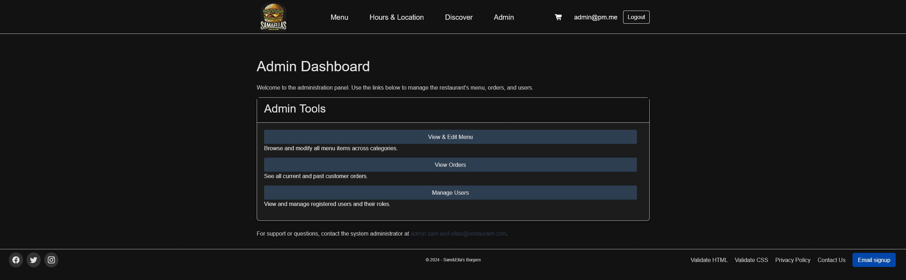

# Sam & Ella's - Full-Stack .NET Food Ordering App

A full-stack online food ordering web application built with C#, ASP.NET Core Razor Pages, Entity Framework Core and SQL Server. The application allows customers to browse menu items, add products to a shopping basket and complete checkout. It also includes an admin area for managing menu items and uploaded product images.

**Live Demo:** [View Live Application](https://2305373.win.studentwebserver.co.uk/CO5227)

  
  

## Demo Accounts

The following test account can be used to explore the application:

- **Customer account**
  - Email: `customer4@gmail.com`
  - Password: `Pa$$w0rd`

## Features

### Customer Features

- **User registration and login**  
  Uses ASP.NET Core Identity to support customer authentication.

- **Dynamic menu**  
  Menu items are retrieved from a SQL Server database and displayed to users.

- **Shopping basket**  
  Customers can add menu items to a basket before checkout.

- **Checkout process**  
  Orders are linked to authenticated customer accounts and validated before submission.

### Admin Features

- **Role-based access control**  
  Admin pages are restricted so that only authorised admin users can access them.

- **Menu management**  
  Admin users can create, read, update, and delete menu items.

- **Image uploads**  
  Product images can be uploaded and linked to menu records.

## Tech Stack

- **Backend:** C#, ASP.NET Core Razor Pages
- **Database:** SQL Server
- **ORM:** Entity Framework Core
- **Authentication:** ASP.NET Core Identity
- **Frontend:** HTML5, CSS3, JavaScript, Bootstrap
